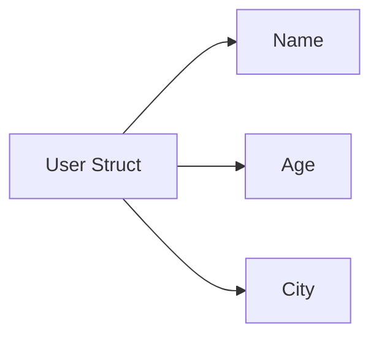

A struct is simply a block of memory where each field is stored one after another.



Memory layout (conceptually):

```
+-------------------------+
| Name | Age | City       |
+-------------------------+
```

Each field occupies memory based on its type.

---
[[Struct]]