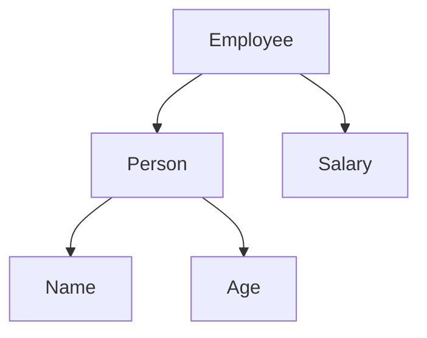

# Struct Embedding

> [!INFO]
> **Struct embedding** is a feature in Go that allows one struct to include another struct as an anonymous field. It is Go's primary mechanism for **composition**, allowing types to reuse fields and methods without inheritance.

---

## Why Does Go Have Struct Embedding?

Many object-oriented languages use inheritance to reuse code.

For example, in Java:

```java
class Person {
    String name;
}

class Employee extends Person {
    int salary;
}
```

Go deliberately **does not support inheritance**. Instead, it encourages **composition over inheritance**.

Rather than saying:

> Employee **is a** Person

Go usually models the relationship as:

> Employee **has a** Person

Struct embedding is one way to achieve this composition while still allowing convenient access to the embedded type's fields and methods.

---

## Basic Syntax

A normal field has both a name and a type.

```go
type Employee struct {
    Person Person
}
```

An embedded field omits the field name.

```go
type Employee struct {
    Person
}
```

The field name is automatically inferred from its type.

---

## Basic Example

```go
package main

import "fmt"

type Person struct {
    Name string
    Age  int
}

type Employee struct {
    Person
    Salary int
}

func main() {
    employee := Employee{
        Person: Person{
            Name: "Alice",
            Age:  28,
        },
        Salary: 70000,
    }

    fmt.Println(employee.Name)
    fmt.Println(employee.Age)
    fmt.Println(employee.Salary)
}
```

Output

```
Alice
28
70000
```

Notice that we accessed `employee.Name` directly even though `Name` belongs to `Person`.

---

# What Happens Internally?

Conceptually, the struct still contains another struct.



Memory layout is roughly:

```
Employee
+--------------------+
| Person             |
|   Name             |
|   Age              |
| Salary             |
+--------------------+
```

The compiler **promotes** the fields of the embedded struct, allowing them to be accessed as if they belonged to the outer struct.

---

# Field Promotion

Although `Employee` doesn't define a `Name` field directly, Go promotes the embedded field.

Instead of writing:

```go
employee.Person.Name
```

you can write:

```go
employee.Name
```

These two statements are equivalent.

```go
fmt.Println(employee.Name)

fmt.Println(employee.Person.Name)
```

Output

```
Alice
Alice
```

---

# Embedding Multiple Structs

A struct can embed multiple types.

```go
type Address struct {
    City string
}

type Contact struct {
    Email string
}

type User struct {
    Address
    Contact
}
```

Usage:

```go
user := User{
    Address: Address{
        City: "Dhaka",
    },
    Contact: Contact{
        Email: "alice@example.com",
    },
}

fmt.Println(user.City)
fmt.Println(user.Email)
```

Output

```
Dhaka
alice@example.com
```

---

# Embedded Methods

Embedding doesn't only promote fields.

It also promotes methods.

```go
package main

import "fmt"

type Person struct {
    Name string
}

func (p Person) Greet() {
    fmt.Println("Hello,", p.Name)
}

type Employee struct {
    Person
}

func main() {
    employee := Employee{
        Person: Person{
            Name: "Alice",
        },
    }

    employee.Greet()
}
```

Output

```
Hello, Alice
```

Although `Employee` has no `Greet()` method, it can still call it because it embeds `Person`.

---

# Overriding Promoted Methods

The outer struct can define its own method with the same name.

```go
type Person struct{}

func (Person) Print() {
    fmt.Println("Person")
}

type Employee struct {
    Person
}

func (Employee) Print() {
    fmt.Println("Employee")
}
```

```go
employee := Employee{}

employee.Print()
employee.Person.Print()
```

Output

```
Employee
Person
```

The outer method hides the promoted one, but the embedded method is still accessible through the embedded field.

---

# Name Conflicts

Suppose both embedded structs have the same field.

```go
type A struct {
    Name string
}

type B struct {
    Name string
}

type C struct {
    A
    B
}
```

This won't work:

```go
c.Name
```

The compiler reports an ambiguous selector because it doesn't know whether `Name` belongs to `A` or `B`.

Instead, specify the embedded type.

```go
fmt.Println(c.A.Name)
fmt.Println(c.B.Name)
```

---

# Embedding Pointer Types

You can embed pointers as well.

```go
type Logger struct{}

func (Logger) Log(msg string) {
    fmt.Println(msg)
}

type Server struct {
    *Logger
}
```

Initialization:

```go
server := Server{
    Logger: &Logger{},
}

server.Log("Server started")
```

Output

```
Server started
```

Embedding pointers avoids copying large structs and allows shared state.

---

# Composition vs Inheritance

Many developers coming from Java or C# think embedding is inheritance.

It is not.

Inheritance means:

```
Employee IS A Person
```

Embedding means:

```
Employee HAS A Person
```

Go encourages building complex types by combining simpler ones.

---

# Real-World Example

A web application may have many entities that share common audit information.

```go
type Audit struct {
    CreatedAt time.Time
    UpdatedAt time.Time
}

type User struct {
    Audit
    Name string
}

type Product struct {
    Audit
    Price float64
}
```

Now both `User` and `Product` automatically have:

- `CreatedAt`
- `UpdatedAt`

Usage:

```go
fmt.Println(user.CreatedAt)
fmt.Println(product.UpdatedAt)
```

Without embedding, these fields would need to be repeated in every struct.

---

# Advantages

- Reduces duplicate code.
- Encourages composition.
- Promotes fields automatically.
- Promotes methods automatically.
- Improves code organization.
- Reuses existing types cleanly.

---

# Common Mistakes

## Confusing Embedding with Inheritance

Embedding does not create an inheritance hierarchy.

---

## Embedding Everything

Not every struct should be embedded.

If two types are unrelated, use normal fields instead.

Bad:

```go
type Car struct {
    User
}
```

Good:

```go
type Car struct {
    Owner User
}
```

Here, `Owner` clearly communicates the relationship.

---

## Ignoring Name Conflicts

Avoid embedding multiple structs that expose many fields with identical names.

---

## Embedding Large Value Types Unnecessarily

Large structs are often better embedded as pointers.

```go
type Server struct {
    *Logger
}
```

instead of

```go
type Server struct {
    Logger
}
```

when shared state or reduced copying is desirable.

---

# Best Practices

- Prefer composition over inheritance.
- Embed only when the embedded type is a natural part of the outer type.
- Use explicit field names when the relationship should be obvious (for example, `Owner User` instead of embedding `User`).
- Keep embedded types small and reusable.
- Avoid deep embedding chains, as they make code harder to follow.
- Don't embed types solely to save a few keystrokes.

---

# Related Pages

- [[Struct]]
- [[Methods]]
- [[Method Receivers]]
- [[Composition]]
- [[Interfaces]]
- [[Pointers]]
- [[Memory Layout]]

> [!NOTE]
> Embedding is **composition**, not inheritance. Go encourages building larger types by combining smaller ones.

---

