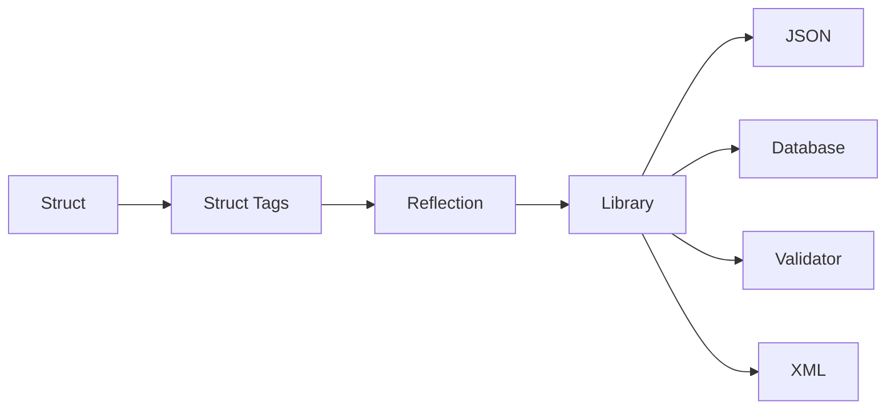

> [!INFO]
> **Struct tags** are string-based metadata attached to struct fields. They do **not** affect how Go compiles or stores a struct. Instead, they provide additional information that libraries can read using the `reflect` package

---

## Why Do Struct Tags Exist?

Suppose you're building a REST API.

Your Go struct might look like this:

```go
type User struct {
    FirstName string
    LastName  string
}
```

When converted to JSON, the default output is:

```json
{
    "FirstName": "John",
    "LastName": "Doe"
}
```

However, many APIs expect:

```json
{
    "first_name": "John",
    "last_name": "Doe"
}
```

How does the JSON package know that `FirstName` should become `first_name`?

The answer is **struct tags**.

```go
type User struct {
    FirstName string `json:"first_name"`
    LastName  string `json:"last_name"`
}
```

Now the JSON package reads the tags and produces the desired output.

---

# What Exactly Is a Struct Tag?

A struct tag is a string literal written immediately after a struct field declaration.

```go
type User struct {
    Name string `json:"name"`
}
```

General syntax:

```go
FieldName Type `key:"value"`
```

Example:

```go
type Product struct {
    ID    int     `json:"id"`
    Name  string  `json:"name"`
    Price float64 `json:"price"`
}
```

Notice that the tag is enclosed in **backticks (`)**, not quotation marks.

---

# Struct Tags Are Metadata

Struct tags **do not change the field itself**.

These two structs occupy the same memory:

```go
type User1 struct {
    Name string
}
```

```go
type User2 struct {
    Name string `json:"name"`
}
```

The only difference is that the second struct contains metadata that libraries can inspect at runtime. Struct tags are exposed through reflection and otherwise ignored by the language itself. :contentReference[oaicite:1]{index=1}

---

# How Libraries Use Struct Tags



The Go compiler stores the tags.

Later, a library uses reflection to read them.

---

# Reflection Reads Struct Tags

The `reflect` package exposes tags through the `StructTag` type.

```go
package main

import (
    "fmt"
    "reflect"
)

type User struct {
    Name string `json:"name"`
}

func main() {
    t := reflect.TypeOf(User{})

    field := t.Field(0)

    fmt.Println(field.Tag.Get("json"))
}
```

Output

```
name
```

The tag is simply looked up by key using `StructTag.Get`. :contentReference[oaicite:2]{index=2}

---

# Multiple Tags

A field may contain multiple tags.

```go
type User struct {
    Name string `json:"name" db:"user_name" validate:"required"`
}
```

Here:

| Tag | Used By |
|------|----------|
| json | JSON encoder |
| db | Database library |
| validate | Validation library |

Each library ignores tags it does not recognize.

---

# JSON Tags

The most common tag.

```go
type User struct {
    Name string `json:"name"`
    Age  int    `json:"age"`
}
```

Produces:

```json
{
    "name": "Alice",
    "age": 25
}
```

---

# Omitting Fields

Use `-`.

```go
type User struct {
    Password string `json:"-"`
}
```

The password will never appear in JSON.

Input:

```go
User{
    Password: "secret",
}
```

Output:

```json
{}
```

---

# Omitempty

Sometimes you don't want empty fields.

```go
type User struct {
    Name string `json:"name,omitempty"`
    Age  int    `json:"age,omitempty"`
}
```

If:

```go
User{}
```

Output:

```json
{}
```

Instead of:

```json
{
    "name":"",
    "age":0
}
```

---

# Renaming Fields

```go
type Product struct {
    ProductName string `json:"product_name"`
}
```

Go field:

```
ProductName
```

JSON field:

```
product_name
```

---

# Database Tags

Libraries such as `sqlx` use `db` tags.

```go
type User struct {
    ID   int    `db:"id"`
    Name string `db:"name"`
}
```

Database row:

| id | name |
|----|------|
| 1 | Alice |

maps automatically into the struct.

---

# Validation Tags

Many validation libraries support tags like:

```go
type User struct {
    Name string `validate:"required"`
    Age  int    `validate:"gte=18"`
}
```

Meaning:

- Name is required
- Age must be at least 18

---

# XML Tags

```go
type User struct {
    Name string `xml:"name"`
}
```

Produces

```xml
<User>
    <name>Alice</name>
</User>
```

---

# BSON Tags (MongoDB)

```go
type User struct {
    ID   string `bson:"_id"`
    Name string `bson:"name"`
}
```

MongoDB libraries understand these tags.

---

# GORM Tags

The GORM ORM uses its own tags.

```go
type User struct {
    ID   uint   `gorm:"primaryKey"`
    Name string `gorm:"size:100"`
}
```

These configure database behavior.

---

# Creating Your Own Tags

You can invent your own tag names.

```go
type Config struct {
    Port int `env:"PORT"`
}
```

Go doesn't care what `env` means.

Your own code can read it using reflection.

---

# Reading Custom Tags

```go
package main

import (
    "fmt"
    "reflect"
)

type Config struct {
    Port int `env:"PORT"`
}

func main() {
    t := reflect.TypeOf(Config{})

    field := t.Field(0)

    fmt.Println(field.Tag.Get("env"))
}
```

Output

```
PORT
```

---

# Struct Tag Syntax

A tag is composed of one or more **key:"value"** pairs separated by spaces.

```go
`json:"name" db:"user_name" validate:"required"`
```

General form:

```text
key:"value" key2:"value2"
```

The `reflect` package defines this convention for parsing tags. :contentReference[oaicite:3]{index=3}

---

# Common Struct Tags

| Tag | Purpose |
|------|----------|
| json | JSON serialization |
| xml | XML serialization |
| yaml | YAML serialization |
| db | Database mapping |
| bson | MongoDB mapping |
| gorm | ORM configuration |
| validate | Validation rules |

There is no fixed list built into Go; packages define and document the tags they understand. The Go Wiki maintains a list of widely used tags. :contentReference[oaicite:4]{index=4}

---

# Important Notes

> [!IMPORTANT]
> Go itself never interprets `json`, `db`, `gorm`, or `validate`.
>
> Those names only have meaning because external libraries read them using reflection.

---

# Common Mistakes

### Using Quotes Instead of Backticks

Incorrect

```go
Name string "json:\"name\""
```

Correct

```go
Name string `json:"name"`
```

---

### Expecting Tags to Affect the Struct

Tags do not change:

- memory layout
- field names
- performance
- field visibility

They are only metadata.

---

### Forgetting Exported Fields

```go
type User struct {
    name string `json:"name"`
}
```

Most serialization libraries ignore unexported fields because reflection cannot access them in the same way.

Use:

```go
type User struct {
    Name string `json:"name"`
}
```

---

# Best Practices

- Use tags only when required by a library.
- Keep tag names consistent across your project.
- Prefer descriptive JSON names like `first_name` instead of abbreviations.
- Don't overload tags with excessive metadata.
- Export fields (`Name` instead of `name`) when libraries need to access them.

---

# Related Pages

- [[Struct]]
- [[Reflection]]
- [[JSON Marshalling]]
- [[encoding/json]]
- [[Struct Fields]]
- [[GORM]]
- [[sqlx]]
- [[Validation]]

Struct tags provide metadata for tools and libraries.

```go
type User struct {
	Name string `json:"name"`
	Age  int    `json:"age"`
}
```

The `encoding/json` package uses these tags during JSON encoding and decoding.

Example JSON:

```json
{
    "name": "Alice",
    "age": 24
}
```

[[Struct]]